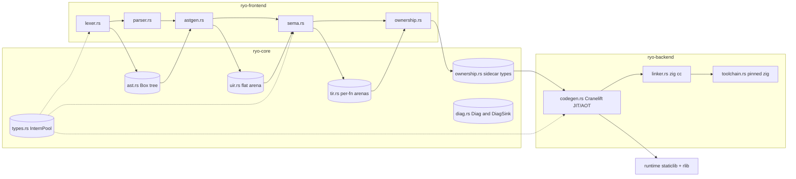

**Status:** Complete (codebase snapshot 2026-07-18, branch `feat/milestone-8.3-inout` @ `64b740a`)

# Architecture Analysis & Improvement Roadmap

Exhaustive review of the Ryo compiler (~22k lines of Rust, 6 workspace crates, 542 `#[test]` across 19 files). Every module was read in full; all claims were then re-verified against the working tree by ten independent review passes. Issue references (`I-xxx`) point to [ISSUES.md](../../ISSUES.md) — entries I-068 through I-111 were filed from this analysis.

---

## 1. Crate Map & Pipeline

Dependency direction is acyclic: `ryo` (CLI, clap) → `ryo-driver` (orchestration, diag rendering) → `ryo-frontend` + `ryo-backend` → `ryo-core` (IRs, types, diagnostics). `ryo-core` depends on nothing internal. The middle end is explicitly modeled on Zig: UIR ≈ ZIR, TIR ≈ AIR (`pipeline_alignment.md`). Ownership analysis types live in `ryo-core` (so codegen can consume them) while the pass lives in `ryo-frontend`.

| Crate | Files (lines) | Role |
|---|---|---|
| `ryo-core` | uir 1470, tir 1383, types 774, ast 546, diag 308, ownership 71 | IRs, InternPool, diagnostics |
| `ryo-frontend` | ownership 3723, sema 3025, parser 1506, astgen 756, lexer 701, indent 213, builtins 171 | source → TIR + ownership |
| `ryo-backend` | codegen 2237, toolchain 139, runtime_lib 40, linker 36 | TIR → object/binary |
| `ryo-driver` | pipeline 526 | staging, ariadne rendering |
| `ryo` | main 102 + integration tests | CLI |
| `ryo-runtime` | lib 746 | string runtime, staticlib+rlib |

---

## 2. Data-Structure Inventory (per stage)

### 2.1 Lexer (`lexer.rs`, `indent.rs`)

- Two token types: `RawToken<'a>` (logos-derived, borrows source) → `Token` (`Copy`; payloads `StringId` / `i64` / `u64` f64-bits). Interning happens **at lex time** — nothing downstream touches source text for identifiers.
- `indent.rs` is a CPython-style indent stack (tabs-only; any leading space is an error) injecting `Newline`/`Indent`/`Dedent`. The `Newline` regex (`\n[ \t]*`) swallows the next line's leading whitespace, which is why the two-stage RawToken form exists.
- Costs: 4 touch points per token variant (I-111); first-error `Result<LexError>` (I-014); indent errors carry fabricated spans (I-016); invalid characters become `Token::Error` and surface later as *parse* errors (I-077); `Token`'s `Display` leaks `<id#N>` into parse diagnostics (I-078); narrow float regex (I-027); `i64::MIN` unspellable (I-017).

### 2.2 AST (`ast.rs`, 546 lines)

- Conventional **Box-tree** — the only non-arena IR. Nodes carry `StringId`s and `SimpleSpan`s.
- `pretty_print` methods are baked into nodes and call `print!` directly to stdout (I-012) — coupled not just to presentation but to process-global I/O; the printer is also incomplete (`IfStmt` prints no children).
- `Eq` absent on anything transitively holding `Literal::Float(f64)` (I-029).
- The `x = 42` decl-vs-assign ambiguity is baked in as `StmtKind::AssignOrDecl` and propagated into UIR before sema resolves it (`sema.rs:550-613`): unknown name → fresh **immutable** binding (a typo silently declares a variable), existing immutable → E0028, existing `mut` → assign.
- Parser (chumsky 0.12): clean precedence ladder (postfix method-call → unary → term → additive → non-assoc ordering → non-assoc equality → `and` → `or`); **zero recovery combinators** — first `Rich` error aborts; chained `a < b < c` is unparseable by construction.

### 2.3 UIR (`uir.rs`, 1470 lines)

- **One program-wide flat arena**: `instructions: Vec<Inst>`, `extra: Vec<u32>`, parallel `spans`, plus `func_bodies` (`ExtraRange` of top-level stmts). `InstRef(NonZeroU32)` — niche-filled, slot 0 sentinel (locked by a size test). `Inst { tag: InstTag (repr u8), data: InstData }` = 24 bytes; spans out-of-band.
- Variadic payloads live in `extra` as `(start, len)` ranges. `ExtraRange.len` is effectively write-only — decoders re-derive counts from inline `argc` words (two sources of truth).
- **Read API allocates**: every View decoder (`call_view`, `if_stmt_view`, …) collects a fresh `Vec<InstRef>` per call; `body_stmts()` collects a slice that is already contiguous (I-091).
- No instruction→function reverse mapping (I-109). Decode paths `unreachable!` on tag mismatch (I-106). `#![allow(dead_code)]` at module top. `ExtraRange` duplicated with tir.rs (I-080).

### 2.4 Types (`types.rs`, 774 lines) — best structure in the tree

- `InternPool`: two hashbrown `HashTable`s keyed **only by handle ids**; string bytes live once in a `string_bytes` arena with `(offset, len)` sidecar; probing hashes the query slice directly — zero key allocation. Primitives at fixed ids 0–6 (`void, bool, int, str, float, error, never`; header docs at :22-23 and :42 still say 0..=5 — stale).
- `compatible()` absorbs `Error`/`Never` (cascade suppression); `is_copy()` = `Int|Float|Bool` (Mojo-`Copyable` analogue; notably excludes `error`/`never`).
- One `unsafe from_utf8_unchecked`, soundly argued. Handles carry no pool identity — cross-pool use silently mis-indexes (standard interner trade-off, undocumented).
- Open design points: `TypeId` newtype vs enum (I-018), name-based annotation resolution in astgen (`resolve_type` = `StringId` equality against 4 pre-interned primitives) — will not scale to user types.

### 2.5 Sema (`sema.rs`, 3025 lines, ~1870 code)

- `Sema { uir, pool, sink, source, file_path, decl_state, queue, name_to_decl, signatures, results }` — worklist driver, `Unresolved → InProgress → Resolved`. Signatures resolve eagerly → recursion works. `CycleInResolution` is a dormant `DiagCode`: `require_decl` is `#[allow(dead_code)]`, deliberately never called from `check_call` (`:1344-1346`) — comptime-era scaffolding.
- Scopes: parent-chained `HashMap`s. `FuncCtx.inst_map: Vec<Option<TirRef>>` sized to the **program-wide UIR length** per function (I-092).
- Error recovery: every failure emits `Unreachable` with `error_type` and analysis continues; the driver prints partial TIR under `--emit=tir` (§4.5 exit criterion of pipeline_alignment.md).
- Stringly dispatch: builtin validation is hand-coded per builtin with triplicated ~30-line blocks (root cause: `BuiltinFunction` carries no param metadata); method dispatch allocates a `String` per call site to match `"len"`/`"is_empty"` (I-092); `builtins::lookup` linear-scans per call (I-034).
- `source`/`file_path` are held **only** so `build_panic_call` can bake `file:line:col` into a unique interned string per call site (I-037), via an O(offset) `char_indices` scan each time.
- Holes: no missing-return check (I-071); duplicate function definitions first-wins silently (I-075); unary `-` Int-only (I-079); `assert` desugars in sema (not astgen) and `panic`/`assert` require string *literals*; `__ryo_panic` calls bypass the signatures table entirely (invisible cross-phase contract via `ABI_CALLEES`).

### 2.6 TIR (`tir.rs`, 1383 lines)

- **Per-function arenas** (each `Tir` owns `instructions`/`extra`/`spans`) — the clone-friendly shape for future monomorphization (`:283-289`); nothing clones a `Tir` yet.
- `TypedInst { tag, ty: TypeId, data: TirData }`; `TirRef(NonZeroU32)` slot-0 sentinel (a bogus-typed `Unreachable` placeholder).
- `TirRef::param(idx)` = `u32::MAX - idx` encodes params as refs — **no `is_param()` predicate exists**; `Tir::inst()` on one panics OOB (I-072). Consumers (ownership `:90`, codegen `:575`) use them as map keys only.
- Call payload packs per-arg `ParamMode{Borrow,Move,Inout}` as a trailing modes section — writer (`TirBuilder::call`) and reader (`call_view`) must change in lockstep. `ParamMode::from_u32` coerces unknown → `Borrow` (I-089).
- Name-based variable resolution (`Var(StringId)`); `LocalSlot(u32)` explicitly deferred (`:121-125`). `spans.len() == instructions.len()` invariant unchecked in `finish()`.

### 2.7 Ownership pass (`ryo-frontend/src/ownership.rs`, 3723 lines = 1973 code + 1750 tests)

- **Sidecar architecture (strength)**: TIR never mutated — index stability is load-bearing for codegen's memoizer. Result: `OwnershipSidecar { functions: HashMap<StringId, FunctionSidecar> }` with `free_schedule: Vec<FreePoint{after, target, span, branch}>`, `free_on_reassign`, `if_branches`. Keyed by function *name* (I-088).
- State: per-`Owner{Param(StringId), Inst(TirRef)}` lattice `NotTracked | Valid | Borrowed | Moved{moved_at}` across 5 HashMaps + 1 HashSet. `Borrowed` seeded only at param init — now including `inout` params (I-053).
- Forward walk; if/else by snapshotting the **3 non-monotone fields** per arm (`states`, `current_owner`, `pending_dead_store`) — monotone fields deliberately flow through (I-061) — then `merge_branches` (any-Moved-wins). A second near-verbatim 2-way merge exists (`merge_non_monotone`, I-090).
- Loops: 2-pass fixed point with a **scratch DiagSink**; diverged pass-1 diagnostics are discarded wholesale, and speculative sidecar writes are never rolled back (I-069, benign today only by BranchId uniqueness). Convergence compares only Moved-ness (I-087).
- Four post passes: last-use frees, anon-temp frees, dead-store W0001, loop-exit jump frees. Double-free exclusion is maintained by **four cross-pass guards** scattered as comments. `free_schedule` order is **nondeterministic** (HashMap/HashSet iteration → unreproducible binaries, I-068). O(N²) jump scheduling (I-064/065); shape re-encoding in 3 helpers (I-066 — actual set: `collect_jump_path`, `collect_named_inits_rec`, `schedule_loop_exit_frees_in`).
- Call-arg algorithm is a careful 3-phase: materialize → partition borrowed/moved and emit E0031 with dual notes → commit moves ("borrows live for the whole call").

### 2.8 Codegen (`codegen.rs`, 2237 lines)

- `Codegen<M: Module>` generic over Cranelift `Module` — JIT/AOT share all lowering; only construction/teardown differs. JIT `execute` transmutes `main` to `fn() -> isize` with no signature check.
- **ABI**: `ValueRepr { Scalar(Value) | Str { ptr, len, cap } }` — str is a 24-byte fat triple; bool = I8 (I-021), int = pointer-sized, float = F64. Str args pass as 3 machine args; str returns via hidden sret slot (`AbiParam::special(..., StructReturn)` at `:422-425`); `inout` spills to a slot pre-call and reloads post-call; callee-side `emit_inout_writeback` stores every inout param before *every* `return_`. The whole layout is **hardcoded to 64-bit** (I-076).
- `FunctionContext` — 19 fields: value state (`locals`, `str_locals` = 3 Variables per str local, `inst_values` memo), free scheduling (`sidecar`, `freed_at`, `free_by_after`, `pending_sweep`, `branch_stack`), control flow (`loop_stack`, `inout_ptrs`, `sret_ptr`), plus module/data/pool/tir. Frees fire through 3 cooperating paths (per-materialization `emit_due_frees`, end-of-statement `sweep_due_frees`, pre-terminator for Break/Continue/Return).
- Fragilities: `sweep_due_frees` silently drops frees anchored to unmaterialized insts (I-070); `eval_inst` returns a str's `ptr` as a dummy scalar (I-083); `break`/`continue` conflated with `return` in terminator tracking (I-081); `never`-call path skips inout reload (I-082); runtime fns re-declared per **use site** (I-093); unconditional CLIF `format!` per function (I-094); per-block locals-map clones (I-095); two duplicated builtin dispatch tables keyed by string compare (`:1601-1619` and `:1797-1812`, I-034); `print` special-cased to an imported `write(1,…)` (I-006); `__ryo_panic` synthesized (write fd 2 + `exit(101)` + trap).
- Errors: `Result<_, String>` throughout plus ~20 `unreachable!`/`unimplemented!` arms — the real contract is "String or panic" (I-106).

### 2.9 Runtime (`runtime/src/lib.rs`, 746 lines) & toolchain

- `#[repr(C)] RyoStrFat { ptr, len: u64, cap: u64 }`; **`cap == 0` = rodata/empty sentinel**, so freeing literals is a no-op. `__ryo_str_push`: doubling growth with a static-source special case (realloc with `old_cap == 0` allocates *without copying*). OOM → `oom_abort` (also fires on `Layout` errors, conflating bug with OOM). `suffix_len: i64` is the one signed length in the ABI (I-105). Not `no_std` (I-043).
- **Dual packaging**: JIT links the runtime as an rlib (symbols registered at `codegen.rs:244-260`); AOT embeds a **~17 MB** staticlib archive via `include_bytes!` (bundles Rust std — root cause of the `-lunwind` workaround). Same source, two artifacts (I-097).
- Toolchain: pinned zig 0.16.0 downloaded to `~/.ryo/toolchain` with **no integrity check** and a fixed temp path that races concurrent installs (I-073); `zig cc` used as linker driver (no cross-compile yet). Runtime cache in `~/.ryo/cache` never evicted — 42 archives / 556 MB observed (I-096). Build scripts duplicated verbatim (`TODO(dedup)`) and can embed a **stale archive** (I-074).

### 2.10 Diagnostics & driver (`diag.rs`, `errors.rs`, `pipeline.rs`)

- `Diag { severity, span, code, message, notes }`; exactly 35 `DiagCode`s mapped to stable `E0001..E0202`/`W0001..2` strings in `diag_code_str` (`pipeline.rs:219-257`; E0200–E0202 reserved for comptime). `DiagSink` caps at 100 with a `TooManyDiagnostics` marker; `error_count` survives truncation. Single ariadne render path; `finalize_diags` tail-block renders once, errs iff any error.
- Fragmentation at the edges: lexer/parser first-error `Result`s converted at the boundary (I-014, I-054); codegen `Result<_, String>`; hand-rolled `CompilerError` with 4 stringly variants (I-011); E-code ↔ roadmap conflict and no stability test (I-086); message printed twice + `Termination` second line (I-103).
- `run_file` echoes source + AST + section headers on every run — **load-bearing**: ~63 integration-test assertions key on it (I-099). `ryo build` writes artifacts to the CWD (I-084).

---

## 3. Cross-Cutting Strengths (keep these)

1. **InternPool** — handle-keyed probing, zero alloc on lookup, single string arena.
2. **Arena IRs with niche-filled refs** — tight layouts, spans out-of-band, sentinel slot 0, size tests locking the invariants.
3. **Sidecar-not-mutation** for analysis results — the right pattern; reuse it for return-flow/CFG (§5 Tier 3).
4. **Single diagnostics taxonomy + render path** — one `diag_code_str`, one ariadne path, `finalize_diags` consolidation.
5. **Per-function TIR arenas** — forward-compatible with monomorphization.
6. **Self-contained toolchain** — pinned zig + embedded runtime = `ryo build` works on a bare machine.
7. **Test surface** — 542 tests incl. ASan/valgrind smoke suites and a frontend bench; ownership invariants pinned by ~1750 lines of `TirBuilder` fixtures.

---

## 4. Weaknesses, Ranked by Architectural Significance

| # | Weakness | Issues |
|---|---|---|
| 1 | Copy-heavy IR read API (Vec per decode, hot in sema/codegen) | I-091 |
| 2 | Ownership pass algorithmics (scratch-sink fixed point, O(N²) jumps, duplicated merges, nondeterministic output) | I-045, I-064–066, I-068, I-069, I-087, I-090 |
| 3 | Stringly builtin/method dispatch across 4 layers; print/panic hard-wired | I-006, I-028, I-034, I-037, I-092 |
| 4 | Error-handling fragmentation (DiagSink / Result / String / panics; no parse recovery) | I-011, I-014, I-016, I-054, I-077, I-078, I-106 |
| 5 | Sema holes & scaling (missing-return, dup defs, inst_map, alloc churn) | I-071, I-075, I-079, I-092 |
| 6 | Codegen god-context (19 fields) + ABI hardcoding + special cases | I-020, I-070, I-076, I-081–083, I-093–095 |
| 7 | Build/toolchain robustness (zig integrity/race, stale archive, cache growth, 17 MB embed) | I-073, I-074, I-096, I-097 |
| 8 | AST is the odd IR out (Box-tree, stdout printer, no Eq, deferred ambiguity) | I-012, I-029 |
| 9 | Test/CI integrity (subprocess-per-test, silent valgrind skip, hollow lanes, unexercised examples) | I-085, I-098–102 |
| 10 | Language-semantics gaps (return-flow, statement-if, numeric tower, div-by-zero) | I-017, I-023–027, I-031, I-032 |
| 11 | Latent-until-feature invariants (param encoding, name-keyed sidecar, tree-TIR, bool FFI, 32-bit) | I-021, I-072, I-088, I-109, I-110, I-076 |

---

## 5. Improvement Roadmap

Sequencing respects the milestone dependencies in `docs/dev/CLAUDE.md`. Each tier is independently shippable.

### Tier 1 — cheap, high leverage (days)

1. **Deterministic `free_schedule`** (I-068). Sort owners by `TirRef`/`StringId` before each post-pass scheduling sweep (or ordered maps). Add a compile-twice-compare-bytes determinism test. *Files: `ownership.rs` post passes.*
2. **Borrowed IR views** (I-091). Views return `&[InstRef]`/iterators over `extra`; `body_stmts` → slice iter; same for TIR `call_view`; codegen consumes slices. Add `assert_eq!(size_of::<Inst>(), 24)` first. *Files: `uir.rs`, `tir.rs`, `sema.rs`, `codegen.rs` call sites.*
3. **Test harness → `CARGO_BIN_EXE_ryo`** (I-098). Pattern already proven in `ryo/tests/common/mod.rs:11,38`. Keep one `cargo run` smoke test. Largest single test-time win (~149 cargo spawns eliminated).
4. **Build-script dedup + staleness fix** (I-074). Extract the byte-identical block into a `build-support` crate (TODO already written at `ryo-backend/build.rs:5-12`); always invoke `cargo build -p ryo-runtime` instead of the `exists()` shortcut.
5. **Zig download hardening** (I-073). Hardcode 3 pinned sha256s, verify before extract; pid-suffixed temp dir; stage-then-rename instead of `remove_dir_all(desired)`.
6. **Runtime cache eviction** (I-096). Keep-last-N by mtime; sweep stale `.tmp.*`; rename `extract_runtime_to_temp`/`cleanup_runtime_temp` to cache semantics.
7. **Quick hygiene**: dead JIT symbol + module-level import cache (I-093); skip CLIF render when not requested (I-094); `ParamMode::from_u32` strictness (I-089); `TirRef::is_param()` + `debug_assert` in `Tir::inst()` (I-072 interim); `diag_code_str` stability test + roadmap E-code fix (I-086); types.rs doc drift (`0..=5` → `0..=6`); remove `#![allow(dead_code)]` where CI `-Dwarnings` allows.

### Tier 2 — structural cleanups (1–2 weeks each)

8. **`BuiltinId` end-to-end** (I-006, I-028, I-034, I-037; enables I-092c). Enum resolved once in sema, carried in UIR/TIR payloads; `BuiltinFunction` gains param descriptors (arity, `TypeKind`s, `ParamMode`s — `str_push` needs modes, not just types); sema validation becomes table-driven (kills ~150 lines of triplication at `sema.rs:1506-1641`); codegen keeps **one** dispatch table keyed by id (kills both `:1601` and `:1797` copies); `print` moves to the runtime crate; panic `file:line:col` moves to a span-keyed side table so `Sema` drops `source`/`file_path` and the O(n) line/col scans.
9. **Ownership pass algorithmics** (I-045, I-064, I-065, I-066, I-069, I-087, I-090). Propagate-only fixed point + single check pass at the converged lattice (removes scratch sink *and* defines sidecar-rollback semantics for I-069); per-loop precomputed `inside_loop`/`has_any`/ref→enclosing-stmt map; promote reachability primitives to `ryo-core/src/tir.rs` per I-066 (note the *actual* re-encoder set: `collect_jump_path`, `collect_named_inits_rec`, `schedule_loop_exit_frees_in`); unify the two merge implementations.
10. **Error-handling unification** (I-011, I-014, I-015, I-016, I-054, I-077, I-078). `thiserror` for `CompilerError`; thread `DiagSink` through the lexer (Token::Error sites emit structured diags, unknown escapes diagnosed, indent errors carry real spans); generalize `finalize_diags` to `Vec<Diag>`; pool-aware parse-error rendering (kills `<id#N>`).
11. **Sema correctness + churn** (I-071, I-075, I-079, I-092). Missing-return check (pair with I-031's `block_definitely_returns`); `DuplicateDeclaration` for functions; `FNeg`; `inst_map` → `HashMap<InstRef,TirRef>` (or per-function UIR slice); borrow instead of clone in `check_call`; interned-id method dispatch.
12. **Codegen context split + ABI centralization** (I-070, I-076, I-081, I-082, I-083, I-095, I-020). Split `FunctionContext` into value-state / free-scheduling / control-flow; one fat-pointer layout definition computed from `pointer_type()` (prerequisite for I-021 and any 32-bit target); terminator enum instead of bool; `reload_inout_args` on the `never` path; end-of-function assert that `pending_sweep` is empty (I-070); undo-log instead of map clones in `emit_scoped_body`.
13. **Test/CI integrity** (I-085, I-099, I-100, I-101, I-102, I-103, I-084). Valgrind skip → loud failure or env-gated opt-out; gate `run_file` chatter behind `--verbose` *after* migrating tests to exit-code assertions; instrument or delete the hollow CodSpeed AOT lanes + add an automated eager-destruction regression bench; CI parse-check over `examples/`; dedupe smoke fixtures and the double asan run; fix `emit_one` double message + `Termination` line; outputs next to source, not CWD.

### Tier 3 — language/architecture moves (longer)

14. **Parser error recovery** (I-030). chumsky `recover_with` at statement boundaries + `MapExtra::emit` for soft errors — the DiagSink/render machinery already supports multi-error; only the parser starves it. Do after/with Tier 2 item 10 so lex+parse co-surface.
15. **Return-flow analysis + expression-if** (I-031, I-032, I-071). Light CFG over TIR as a **sidecar** (the established pattern — never mutate TIR); prerequisite for `match` exhaustiveness later. Also resolves the I-020 memoizer-scoping precondition.
16. **Numeric tower** (I-017, I-023, I-024, I-025, I-026, I-027). One coordinated design: literal grammar, `i64::MIN`, div-by-zero checks, conversions, float widths. Don't piecemeal.
17. **Type-system foundations before user types** (I-018, I-088, I-109, I-110, I-111). `TypeId` enum retry; sidecar keyed by `DeclId`; inst→function map; document/assert tree-TIR; lexer macro table. Phase 5 (lazy Sema) per pipeline_alignment.md is the gating milestone for comptime/generics — per-function TIR arenas are already positioned.
18. **ABI/FFI readiness** (I-021, I-043, I-076, I-105). After Tier 2 item 12 centralizes layouts: bool widening at boundaries, `no_std` runtime (also shrinks I-097's archive), uniform `u64` lengths.
19. **Post-M11 memory work** — per docs/dev/README.md: `arc_optimizer.md`, `copy_elision.md`, `stdlib_optimizations.md` (SSO/CoW/sink params). Runtime comment at `runtime/src/lib.rs:176-177` already defers ARC/CoW policy here.

---

## References

- Issues: [ISSUES.md](../../ISSUES.md) (I-068–I-111 filed from this analysis)
- Dev: [pipeline_alignment.md](pipeline_alignment.md) (UIR/TIR design, §4.5 error recovery), [design_issues.md](design_issues.md) (language-design tracker), [implementation_roadmap.md](implementation_roadmap.md) (milestone sequencing)
- Spec: [specification.md](../specification.md) — Section 5 (ownership & borrowing)
- Milestone: M8.3 `inout` (current branch) — see implementation_roadmap.md
