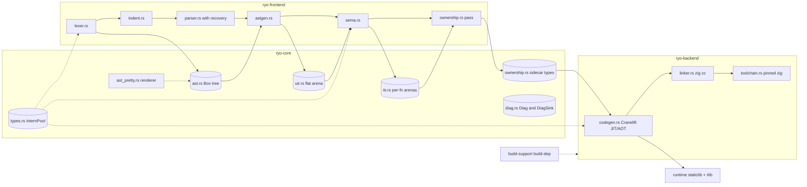

**Status:** Complete (codebase snapshot 2026-08-19, branch `chore/ast-pretty-module` @ `3ca0f92`)

# Architecture Analysis — 2026-08-19

Refresh of [architecture_analysis.md](architecture_analysis.md) (snapshot 2026-07-18, `64b740a`, branch `feat/milestone-8.3-inout`). Every module was re-read at HEAD; each claim from the previous analysis was re-verified and is marked **fixed**, **open**, or **stale** below. Issue references (`I-xxx`) point to [ISSUES.md](../../ISSUES.md) — since M8.4.1 resolved entries are *removed* from that file, so this snapshot records both what was resolved since July and what remains open.

Scale: ~29k lines of Rust source across 7 workspace crates, 809 `#[test]` (previous snapshot: ~22k lines, 6 crates, 542 tests). This branch itself is tiny — 3 commits over `main` extracting the AST pretty printer (`8f57d94`, `567526d`, `3ca0f92`); all other drift below landed on `main` via milestones M8.2–M8.4.2 (parser recovery, `inout`, strview slices, Windows support).

---

## 1. Crate Map & Pipeline



Dependency direction remains acyclic: `ryo` (CLI) → `ryo-driver` → `ryo-frontend` + `ryo-backend` → `ryo-core`. New since the snapshot: **`build-support`**, a dependency-free crate used as a *build-dependency* of both `ryo` and `ryo-backend`, deduplicating the runtime-archive build logic (`build-support/src/lib.rs:36-90`). The pipeline is now the full M8.1+ shape — ownership analysis runs between sema and codegen, emitting a sidecar consumed positionally by codegen.

| Crate | Files (lines) | Role |
|---|---|---|
| `ryo-core` | tir 1976, uir 1529, types 892, ast_pretty 480, ast 351, diag 337, ownership 112, errors 69 | IRs, InternPool, diagnostics, sidecar types |
| `ryo-frontend` | ownership 9504, sema 4168, parser 1951, lexer 1011, astgen 835, indent 277, builtins 233 | source → TIR + ownership |
| `ryo-backend` | codegen 2705, toolchain 269, runtime_lib 66, linker 27 | TIR → object/binary |
| `ryo-driver` | pipeline 823 | staging, ariadne rendering |
| `ryo` | main 133 + integration tests (198) | CLI |
| `ryo-runtime` | lib 1091 | string/slice runtime, staticlib+rlib |
| `build-support` | lib 108 | shared build-script runtime-archive build |

---

## 2. Data-Structure Inventory (per stage)

### 2.1 Lexer (`lexer.rs` 1011, `indent.rs` 277)

- Two-token-type design unchanged: borrowed `RawToken<'a>` (logos) → `Copy` `Token` with `StringId`/`i64`/f64-bits payloads; interning still happens at lex time.
- **Fixed:** first-error `Result<LexError>` (I-014) — `lex` now takes a `DiagSink` and recovers throughout (`lexer.rs:360`); invalid characters are diagnosed at lex time with a `Token::Error` placeholder (I-077 fixed, `:376-389`); unknown escapes keep bytes verbatim + `UnknownEscape` diag (`:462-479`). Indent failure is the one remaining hard abort (`:392-404`).
- **Fixed:** `i64::MIN` unspellable (I-017) via `Token::IntLitMin` (`:41-47`), folded to `Literal::Int(i64::MIN)` at parse time (`parser.rs:617-623`). **Fixed:** fabricated indent-error spans (I-016) — `IndentError` carries the offending `Newline` token's own span (`indent.rs:16-26,55-58`), test-pinned.
- New tokens: `Move`, `Struct`, `Enum`, `Match`, `Inout`, `Amp`, `Break`, `Continue`, `For`, `In`, compound-assign ops, `Percent`, `Arrow` (`lexer.rs:61-100`). CRLF handled in both lexer (`:316`) and indent (`indent.rs:47-50`).
- **Open:** I-111 (4 touch points per token variant, verified `:36-117/:119-189/:195-330/:493-611`); I-027 (float regex still `[0-9]+\.[0-9]+`, `:201`). `unescape` relies on an implicit regex-guaranteed invariant (`:437`).

### 2.2 AST (`ast.rs` 351 + `ast_pretty.rs` 480) — this branch's subject

- **Fixed (this branch):** I-012 — `pretty_print`-on-stdout is gone from `ast.rs` (0 `print!` occurrences); the printer was extracted to `ast_pretty.rs` exposing `render_program(&Program, &InternPool) -> String` (`ast_pretty.rs:21-25`), with the single stdout call in the driver (`pipeline.rs:333-336`) behind `ryo ir --emit=ast`. The printer is now complete — if/elif/else children rendered and test-pinned (`ast_pretty.rs:189-211,359-415`). Follow-up commits fixed string escaping (`{:?}` on the pool string, `:260`).
- Box-tree shape unchanged (I-126 open); `TypeExpr` pinned at 24 bytes by test (`ast.rs:346-350`); `TypeExpr.is_view` is now explicitly legacy (`:142-145`).
- New: `StmtKind::Error` placeholder nodes from parser recovery, lowered to nothing by astgen (`ast.rs:64-68`, `astgen.rs:77-80`).
- `AssignOrDecl` ambiguity still baked in (`ast.rs:42-45` → `astgen.rs:296-300` → `sema.rs:644-707`): unknown name → fresh **immutable** binding (typo silently declares), pinned by `sema.rs:3454`.
- **Open:** I-029 (no `Eq` through `Literal::Float(f64)`, `ast.rs:211`). Minor `ast_pretty` smells: hardcoded `├── ` for params/`returns:` regardless of last-ness (`:120-131`, cosmetic); per-node `format!` churn acceptable on a debug path.

### 2.3 UIR (`uir.rs`, 1529 — smallest delta, +59)

- Invariants intact: slot-0 sentinel, niche-filled `InstRef`, `Inst ≤ 24` bytes now pinned by `inst_stays_small` (`:1316-1323`), checked u32 conversions on arena pushes (`:571-579`).
- Delta: `Slice` tag/data/builder/dump (M8.4) and trusted-producer documentation (`:46-54`). Decode-path `unreachable!` on tag mismatch (I-106) is resolved as a *documented* trusted-producer contract; sites unchanged (e.g. `:875,:893`).
- **Open:** I-091 (view decoders allocate fresh `Vec`s — `call_view` `:870-886`, `if_stmt_view` `:1004-1046`); I-109 (no instruction→function reverse map); I-080 (`ExtraRange` duplicated with tir.rs; `len` still effectively write-only, `:879,:967` vs `:345`). I-047's text is stale (field is now `mode: ParamMode`, `:282-287`) though its substance stands.
- Stale comment: `uir.rs:1-6` claims `--emit=uir` is "still TODO" — it is wired (`pipeline.rs:349,378-380`). `#![allow(dead_code)]` still at `:6`.

### 2.4 Types (`types.rs`, 892) — still the best structure in the tree

- `InternPool` design unchanged (hashbrown tables keyed by handle ids, content-probed hashing, zero key allocation). Primitive slots now `0..=7` with `strview` at slot 7 (`:121-128`, insertion order `debug_assert`ed at `:333`); header docs fixed (previously stale `0..=5`).
- New: `Tag::View` + `TypeKind::View` + closed `ViewKind::{Str,Bytes,Slice(TypeId)}` with a documented "never parameterize over arbitrary T" rationale (`:98-102,149,166-182`); `str_view`/`is_view`/`view_elem`/`owner_view` accessors; `find_str` read-only lookup for codegen (`:521-528`).
- **Changed:** `is_copy()` now includes `TypeKind::View(_)` (`:402-407`) — copying a view aliases but owns nothing.
- **Open:** I-018 (`TypeId` newtype vs enum — now documented in-code as deliberate, `:29-33`); I-019 (`tuple_elements_vec` allocates, `repr(transparent)` blocker documented); I-127 (the one `unsafe from_utf8_unchecked`, `:566-571` — SAFETY comment in place, human sign-off pending). Cross-pool handle misuse remains undocumented.

### 2.5 Sema (`sema.rs`, 4168 lines, 173 tests)

- Façade `analyze(...) -> Vec<Tir>` (`:154-162`) over the same worklist driver (`Unresolved → InProgress → Resolved`). `require_decl` remains `#[allow(dead_code)]` comptime-era scaffolding (`:362-363`) but is now substrate-tested (`:3092`); `CycleInResolution` still dormant.
- **Fixed:** I-071/I-031 — missing-return checking via `Tir::block_definitely_returns` driving `MissingReturn` E0036 (`:489-502`, ~10 return-flow tests). I-075 — duplicate function definitions now diagnosed (`DuplicateDeclaration`, `:248-262`).
- New: program-wide `call_arg_refs` pre-scan gating `&` to direct call-argument position (`:191-215,1236-1245`); M8.3 `inout` borrow-agreement checks replayed for builtins and user calls (`:1711-1824`); M8.4 view checking — slice bounds (`:1194-1226`), implicit `str → strview` and P6' view→str re-borrow in `check_call` (`:1668-1695`), `str(view)` materialize intercept synthesizing `__ryo_str_from_view` (`:1552-1558,2044-2100`); W0002 `RedundantMove`, W0003 case-A `RedundantMaterialize`; `__ryo_` prefix and `range` reserved; `VoidValueInExpression`.
- **Open (re-verified):** I-028/I-034 (triplicated builtin validation, moved to `:1837-1926`; `BuiltinFunction` still lacks arity/type descriptors); I-092 (`String` alloc per method-dispatch site, `:1127`); I-037 (`byte_offset_to_line_col` O(offset) scan, `:2254-2269`; `__ryo_panic` still bypasses the signatures table); I-079 (unary `-` int-only). New risk: `analyze_expr` fallthrough is `panic!`, not a diag (`:1248-1251`).

### 2.6 TIR (`tir.rs`, 1976 — largest core growth, +593)

- **Fixed:** I-072 — `TirRef::is_param`/`as_param_index` exist with the param-sentinel band (`u32::MAX - idx`, collision-free `> u32::MAX/2`) debug-asserted on both constructors (`:79-133`); `Tir::inst`/`span` hard-`assert!` even in release (`:399-419`).
- Tree-shape invariant now documented on `Tir` and debug-validated per built body via `validate_tree_shape` in `finish` (`:364-369,935-936,1275-1296`). `TirBuilder::call` asserts `modes.len() == args.len()` (`:730-734`).
- **Fixed:** I-066 — structural-reachability primitives promoted to core and documented as the single source of truth for TIR shape: `walk_operands`/`ChildKind` (`:1167-1268`), `collect_reachable`, `loop_body`, `block_definitely_returns`/`stmt_definitely_returns` (`:1367-1415`, backs E0036), `collect_jump_path` (`:1435-1499`).
- New tags: `Slice`, `ViewOfStr`, `ViewAsStr`, float op set, `StrLen`, `Unreachable` (error-recovery sentinel), `ParamMode::Inout`.
- **Open:** I-091 (allocating view decoders); I-080 (`ExtraRange` duplication). `spans.len() == instructions.len()` still unchecked in `finish` (structurally maintained by `push`). **Resolved since the snapshot (this branch):** I-089 — `from_u32` now returns `Option` (`:303-313`) and the `call_view` decode rejects unknown words as producer corruption.
- In-tree doc debt: stale header comment (`:1-6`, `--emit=tir` is wired at `pipeline.rs:398-401`); dangling `I-106` citation at `:55` — resolved entries are deleted from ISSUES.md, so AGENTS.md forbids exactly this.

### 2.7 Ownership — sidecar types (`ryo-core/src/ownership.rs`, 112) + pass (`ryo-frontend/src/ownership.rs`, 9504; 108 tests)

- **Fixed:** I-088 — sidecar is now positional: `OwnershipSidecar.functions: Vec<FunctionSidecar>` aligned with the `tirs` slice, each entry carrying `name` only so codegen can `debug_assert!` the alignment (`ryo-core/src/ownership.rs:62-80`; consumed at `codegen.rs:509-526`). `Default` deliberately not derived. I-117's arm-gated drops are now first-class `ConditionalDeadDrop` (`:41-46`). All fields are live codegen inputs — the snapshot's `#[allow(dead_code)]` annotations are gone.
- Pass structure at HEAD: pre-passes `collect_loop_nesting` + `collect_view_liveness` → forward walk (`analyze_stmt` `:2087`, `visit_expr` `:3600`, `drain_dying_views` after every statement) → ordered post passes: last-use frees with P5 `defer_anchor` → anon-temp frees → dead-store W0001 drain → W0003 case-B → `conditional_dead_drops` conversion → loop-exit jump frees (`LoopExitCtx` `:3378-3405`) → return epilogue (`:1661-2085`).
- **Fixed:** I-045/I-069 (loop analysis is now propagate-then-check against a scratch sink **and** a discarded `sidecar.clone()` staging buffer, bounded by `MAX_PROPAGATE_PASSES = 2`, documented `:3157-3164`); I-087 (convergence compares full `OwnerState` + live projections, `:3210-3243`); I-064/065 (`LoopExitCtx` precomputes loop membership once); I-068 (deterministic `free_schedule` via `owner_sort_key`, pinned by test `:8598`); I-090 (merges now share per-field primitives `:365-507`); I-066 (uses the core reachability walkers; residual hand-recursive `collect_named_inits_rec` `:1481` / `collect_materialize_sites` `:1539`).
- State grew to 15 fields (`:103-241`); non-monotone snapshot set is now **4** fields (`:2784-2791`).
- New architecturally: the entire M8.4 view layer (P1–P6', E1–E5) — projection registration/freeze/last-use (`:860-1085`), per-arm liveness refinement (`:2668-2733`), `SourceProjected`/`ViewEscape` diagnostics, W0003-B hazard-log heuristic (`:1599-1659`), `owner_at_read` per-read snapshots (`:134-141`).
- **Open / risks:** I-128 (entry-point functions ~420 lines each); I-129 (dense `TirRef`-keyed `HashMap`s vs R18 `Vec` side tables); 15-field state cloned per if-arm (`:2799-2842`) and maps+sidecar cloned per propagate pass (`:3072-3078`); `expect("param exists")` panics (`:86-91`); Rule-7 call-arg partition has duplicated look-through logic (`:3752-3758` vs `:3847-3853`). Stale comment at `:1932-1934` ("no `free_on_reassign` entries exist") — the field is populated and tested.

### 2.8 Builtins (`builtins.rs`, 233)

- `BuiltinFunction` gained ABI metadata — `borrowed_scalar_params`, `view_borrow_params` (`:3-20`) — consumed by ownership's Rule-7 partition and codegen, replacing name-string matching there. `BUILTINS` holds 7 entries; `ABI_CALLEES` covers synthesized `__ryo_panic`/`__ryo_str_from_view`; `RESERVED_NAMES = ["range"]`.
- **Open:** I-034 (linear-scan `lookup`, `:112-114`); still no arity/param-type validation metadata, so sema's hand-coded per-builtin checks remain.

### 2.9 Codegen (`codegen.rs`, 2705)

- `ValueRepr` gained a third variant `View { ptr, len }` (M8.4) alongside `Scalar`/`Str` (`:122-136`); `eval_inst_view`/`eval_str_or_view_parts` (`:2132-2269`); 2-word view ABI.
- **Fixed:** I-081 (`Terminator` enum replaces the Break/Continue/Return-conflating bool, `:49-55`); I-082 (`never`-returning calls reload inout slots before the trap, `:2515-2527`); I-083 (`eval_inst` errors loudly on str/view reaching the scalar path `:1381-1398` — though the sret path still returns a dummy `Ok(ptr)` at `:2551`); I-088 (positional sidecar + name `debug_assert!`); I-006/I-010 (`print`/`panic` are ordinary runtime calls now — `ryo_print`/`ryo_panic`, `:2329-2388`); I-070 *mitigated* (end-of-function leak `debug_assert!`, `:713-722` — leak-direction only, and `sweep_due_frees` still silently filters never-anchored frees `:1756`).
- Frees fire through four paths (due/sweep/pre-terminator/conditional-dead-drop) with a `freed_at: HashSet<usize>` double-emission guard (`:204`). `emit_return` remains the single `return_` chokepoint with inout write-back (`:822-830`).
- **Open (re-verified):** I-093 (no name→`FuncId` cache `:1653-1671`; dead `ryo_str_alloc` JIT registration `:312`); I-094 (unconditional `format!("{}", ctx.func)` per function `:727`); I-095 (now *three* map clones per block `:772-774`); I-034 (stringly builtin dispatch + `== "main"` at four sites); I-076 (`STR_SLOT_SIZE`/`VIEW_SLOT_SIZE`/I64 len-cap still hardcoded, `:40-43` — 32-bit-hostile); `Result<_, String>` everywhere + 38 `unreachable!`. **Resolved since the snapshot (this branch):** the `:2454` `modes.get(i).unwrap_or(Borrow)` fallback — the lookup is now total via an `ok_or_else` internal error (I-133, I-089 twin).

### 2.10 Toolchain / runtime_lib / linker / build scripts

- `toolchain.rs` (269): pinned zig 0.16.0; new Windows support — `.zip` archives with a zip-slip guard (`enclosed_name()`, `:160-202`). **Open:** I-073 — no sha256/signature verification (`:89-134`), fixed temp-dir race (`:76,81`), `remove_dir_all(desired)` before rename (`:144`).
- `runtime_lib.rs` (66): content-hash-keyed cache with atomic rename; Windows `.lib` naming. **Open:** I-096 — no eviction; `~/.ryo/cache` held **78 archives** when re-measured (snapshot observed 42). I-097 number is stale: the `no_std` migration shrunk the debug archive to **6.06 MB** (was quoted 17.9 MB).
- `linker.rs` (27): unchanged, shells `zig cc`.
- **Fixed:** the `TODO(dedup)` build-script duplication — runtime-archive resolution now lives in **`build-support`** (`ensure_runtime_archive`, `build-support/src/lib.rs:36-90`; separate `runtime-build` target dir avoids the cargo lock deadlock). Remaining duplication: the sha256-of-archive block is still byte-similar in both `build.rs` files; `ryo/build.rs`'s `resolve_git_ref` doesn't watch detached HEADs.

### 2.11 Driver (`pipeline.rs`, 823)

- `EmitKind { Ast, Uir, Tir, Clif }` staged behind `ryo ir --emit=…` (`:1-11,349`); `display_ast` calls `ast_pretty::render_program` (this branch).
- **Fixed:** I-125 (parser recovery co-surfaced: `parse_source` lexes into a sink, runs chumsky with `into_output_errors()`, returns partial programs with `StmtKind::Error` placeholders, `:109-155`); I-078 (`rich_error_message` re-renders identifiers/strings through the pool — no more `<id#N>`, `:174-203`); I-086 (E-code stability/uniqueness test pins all 41 codes, `:640-741`); I-103 (message in report header only, `:250-255`; duplicate print suppressed in `main.rs:91-98`); I-084 (`.o`/exe land next to the source via `with_extension`, `:39-47`, test-pinned).
- `DiagCode` grew 35 → **41** variants (38 E + 3 W); new since snapshot: `InvalidCharacter`, `UnknownEscape`, `MissingReturn`, `DuplicateDeclaration`, `RedundantMove` (W0002), `RedundantMaterialize` (W0003), `ViewEscape`, `SourceProjected`, `RangeArgType`, `ReservedBuiltinName`, `UndefinedAssignTarget`. `DiagSink` 100-cap with error-count survival now test-pinned (`diag.rs:319-336`).
- **Open:** I-099 (`run_file` still echoes `[Input Source]`/`[AST]`/`[Codegen]`; 37 integration-test assertions key on it); I-013 (`lex`/`parse`/`ir` still separate subcommands); I-130 (recovery is line-granular — a broken block *header* leaks its indented body into the enclosing scope; `skip_garbage` is indentation-unaware, `parser.rs:71-85`).

### 2.12 CLI (`main.rs`, 133) & tests (`ryo/tests/`)

- New: CLI runs on a 32 MiB spawned thread (`:72-84`) — Windows' 1 MiB main stack overflowed the recursive frontend/JIT in debug.
- `integration_tests.rs` 198 tests (was ~149); new `common/mod.rs` harness using `CARGO_BIN_EXE_ryo` with 28 named fixtures; `asan_smoke.rs` 27; `valgrind_smoke.rs` 28.
- **Fixed:** I-085 (missing valgrind is a hard failure locally, skip only via `RYO_SKIP_VALGRIND=1` or CI); I-101 (`test_examples_parse` exercises the examples tree).
- **Open:** I-098 (`run_ryo_command` still spawns `cargo run --` per test, 166 call sites); I-102 (duplicate build work across lanes/suites — `zig_path()` shells `ryo toolchain status --path` per build).

### 2.13 Runtime (`runtime/src/lib.rs`, 1091)

- `#![no_std]` under `staticlib`; C-heap `malloc/free/realloc`; custom panic handler → `abort`; `rust_eh_personality`/`_fltused` stubs. ABI: `RyoStrFat { ptr, len, cap }` with `cap == 0` = rodata sentinel; new `RyoSlice { ptr, len }` with the null-ptr-when-len==0 invariant guarded by `__ryo_slice` (range + UTF-8 boundary panics, exit 101).
- **Fixed:** I-006/I-010 — `ryo_print`, `ryo_panic`, `ryo_str_from_view`, `__ryo_slice` moved from codegen into the runtime (`:101,:115,:259,:312`); Windows `_write` with `_O_BINARY`. 13 JIT-registered symbols.
- Smells: `oom_abort` still conflates genuine OOM, u64→usize narrowing, and `checked_add` overflow; `ryo_print`/`ryo_panic` null checks are `debug_assert!` only (`:105,:117`).

---

## 3. Delta Since the Previous Snapshot

**Resolved (removed from ISSUES.md, verified in code):** I-006, I-010, I-012, I-014, I-016, I-017, I-031, I-045, I-053/054, I-061, I-064–I-066, I-068–I-072, I-075, I-077, I-078, I-081–I-088, I-090, I-101, I-103, I-106, I-108, I-110, I-112–I-119, I-125. I-070 mitigated (debug-only leak assert).

**New architecture:** `ast_pretty` module (this branch); parser error recovery with `StmtKind::Error`; M8.3 `inout` end-to-end (parser → sema agreement checks → codegen spill/reload/write-back); M8.4/8.4.1 strview end-to-end (`Tag::View`, `Slice`/`ViewOfStr`/`ViewAsStr`, third `ValueRepr`, `RyoSlice`/`__ryo_slice`/`ryo_str_from_view`); TIR structural-reachability primitives + tree-shape validation; return-flow analysis (E0036); positional ownership-sidecar contract with codegen alignment assertion; staged `ryo ir --emit=ast|uir|tir|clif`; E-code stability test; `build-support` crate; Windows support (toolchain zip, runtime `_write`/`_fltused`, CLI stack size); ASan/Valgrind fixture harness.

**New issues filed since the snapshot:** I-126 (AST Box-tree vs R1), I-127 (unsafe-utf8 sign-off), I-128 (pass entry-point sizes), I-129 (dense HashMaps vs `Vec` side tables), I-130 (parser recovery mis-nesting). This analysis itself filed I-131 (panic-on-invariant sites), I-132 (runtime FFI robustness), I-134 (the stale comments below), I-135 (Rule-7 look-through duplication), I-136 (ownership state cloning), I-137 (3K-line tidy gate + splits, see §4). **Resolved since the snapshot (this branch, `9c6b6c6`):** I-089 and its twin I-133 — strict `ParamMode` decode; both removed from ISSUES.md.

**In-tree doc debt found during verification:** stale "emit flag still TODO" headers (`tir.rs:1-6`, `uir.rs:1-6`); dangling `I-106` citation (`tir.rs:55`, against the AGENTS.md no-dangling-IDs rule); stale "no `free_on_reassign` entries" comment (`ryo-frontend/src/ownership.rs:1932-1934`).

---

## 4. File-Size Recommendations (3K-line limit)

**Rule:** no Rust source file in the workspace should exceed **3000 lines**, tests included (same convention as rust-lang's `src/tools/tidy` file-length gate). Tracked as I-137. Current offenders, verified with `wc -l` at HEAD:

| File | Lines | Over by |
|---|---|---|
| `ryo-frontend/src/ownership.rs` | 9504 | 3.2× |
| `ryo-frontend/src/sema.rs` | 4168 | 1.4× |
| `ryo/tests/integration_tests.rs` | 4002 | 1.3× |

**Tidy check.** No tidy tool exists in this repo yet; add a rust-lang-style gate to CI (alongside `fmt`/`clippy`) that fails on any offender, with an explicit allowlist for the three files above until the splits land — the allowlist makes the check executable from day one and shrinks as splits merge:

```bash
find . -path ./target -prune -o -name '*.rs' -print | xargs wc -l | awk '$1 > 3000 && $2 != "total"'
```

### 4.1 `ownership.rs` (9504) → `ownership/` module directory

The file already self-organizes into `// ---------- ... ----------` bands; the seams below follow them. Line refs are HEAD anchors for the moves.

| New module | Contents (HEAD anchors) | ~Lines |
|---|---|---|
| `ownership/mod.rs` | Module docs, `Owner`/lattice (`:38-258`), `Ownership` state (`:103-241`), `check()` entry (`:1448`), `analyze_function` post-pass driver (`:1661-2085`), `pub(crate) use` re-exports so call sites don't change | ~900 |
| `ownership/merge.rs` | `merge_branches` (`:286`), per-field merge primitives (`:365-507`), `states_differ_snapshot` (`:3210`), `merge_non_monotone` (`:3249`) | ~450 |
| `ownership/views.rs` | M8.4 projection band (`:855-1085`: register/remove/drain/prune/`check_source_projected`), `ViewLiveness` + `collect_view_liveness` cluster (`:1150-1447`), per-arm refinement (`:2668-2733`) | ~800 |
| `ownership/loops.rs` | Loop/branch predicates (`:509-807`), `collect_loop_nesting` (`:1087`), `analyze_loop_body`/`while`/`for_range` (`:3041-3210`), `LoopExitCtx` + jump-free scheduling (`:3378-3600`) | ~1100 |
| `ownership/walk.rs` | Forward walk: `analyze_stmt` (`:2087`), var-decl/assign/return (`:2144-2371`), `analyze_if_stmt` (`:2735`), `visit_expr` + `recurse_operands` (`:3600-4080`) | ~1600 |
| `ownership/frees.rs` | Free scheduling: `defer_anchor` (`:1422`), `collect_named_inits*` (`:1468`), materialize/W0003 (`:1523-1659`), `collect_last_uses`/`find_consumers` (`:3305-3378`), return epilogue (`:2290`) | ~600 |
| `ownership/diag_fmt.rs` | Name/diagnostic formatting (`:2577-2627`) | ~50 |
| `ownership/tests/` | The inline test module is **5416 lines** (`:4082-9504`) — split by feature area into `tests/merge.rs`, `tests/frees.rs`, `tests/loops.rs`, `tests/inout.rs`, `tests/views.rs` (the ~35 M8.4 tests), sharing one `tests/common.rs` harness | 6 × ~900 |

### 4.2 `sema.rs` (4168) → `sema/` module directory

| New module | Contents (HEAD anchors) | ~Lines |
|---|---|---|
| `sema/mod.rs` | `DeclId`/`DeclState`/`FunctionSig`/`Binding`/`Scope` (`:62-153`), `analyze` façade (`:154`), `Sema` struct + worklist driver (`:168-397`), `analyze_function` (`:398-509`), `FuncCtx` (`:510`) | ~510 |
| `sema/stmt.rs` | `analyze_stmt` (`:517-889`), `analyze_block(-_seeded)` (`:890-928`), `check_condition_bool` (`:929`), `resolve_var_decl_type` (`:944`), `check_bindable_value` (`:2276`) | ~550 |
| `sema/expr.rs` | `analyze_expr(-_allow_never)` (`:977-1262`), `check_slice_bound` (`:1263`), `check_binary_op` (`:1277-1541`), `bin_op_symbol` (`:2296`) | ~600 |
| `sema/call.rs` | `check_call` + view param/return rules (`:1542-1761`), `borrow_target_reason` (`:1762`), `check_reserved_builtin` (`:2315`) | ~400 |
| `sema/builtins.rs` | `emit_builtin_call` (`:1783-2007`), materialize intercept (`:2008-2101`), `emit_panic`/`emit_assert`/`build_panic_call` (`:2102-2253`), `check_print_args` (`:2220`), `byte_offset_to_line_col` (`:2254`) | ~500 |
| `sema/tests.rs` | Inline test module (`:2334-4168`) fits under the limit as one file; split further only if it grows past 3K | ~1835 |

### 4.3 `integration_tests.rs` (4002) → per-area integration test binaries

Each file under `ryo/tests/` is its own test binary, so splitting is free of module plumbing — and it improves test parallelism (198 tests currently serialize inside one binary). The file already clusters by feature area; split along those clusters, all sharing the existing `common/mod.rs` harness:

| New file | Contents (areas as ordered at HEAD) | ~Tests |
|---|---|---|
| `integration_driver.rs` | lex/parse drivers, `ir --emit` staging, warnings-on-success, exit codes | ~35 |
| `integration_basics.rs` | print/strings, functions, if/elif, mut/compound assign, while/for-range | ~45 |
| `integration_assert_panic.rs` | assert/panic shapes, 101 exits, `never` rejection matrix | ~25 |
| `integration_aot.rs` | AOT build+run, benchmark files, `test_examples_parse` | ~15 |
| `integration_ownership.rs` | inout write-back/aliasing, E0020/E0021/E0022, W0001, conditional move/rebind, free-schedule behavior | ~50 |
| `integration_views.rs` | M8.4 slices/views, runtime slice panics, ViewEscape/freeze diagnostics | ~30 |

Also switch these from `cargo run --` to the `CARGO_BIN_EXE_ryo` harness (`common/mod.rs` already proves the pattern) while moving — that chips at I-098 in the same pass.

### 4.4 Watch list (under 3K, trending up)

- `ryo-backend/src/codegen.rs` — **2705**, ~10% headroom. When it crosses: split the `eval_inst*` expression family and call emission (`:2000-2605`) from block/statement scaffolding.
- `ryo-core/src/tir.rs` (1976), `ryo-frontend/src/parser.rs` (1951) — healthy; parser would split statement vs expression parsers if needed.

### 4.5 Split discipline

- Pure moves, zero logic changes; `cargo test` must stay green after each module extraction (one module per commit).
- Keep the module header docs on `mod.rs`; child modules get a one-line `//!` pointing back.
- Re-export through `mod.rs` (`pub(crate) use`) so existing `ownership::check` / `sema::analyze` call sites (`pipeline.rs`) are untouched.
- Tests follow the code they exercise; shared fixtures go in a `common` submodule (the `ryo/tests/common/mod.rs` pattern already exists).

---

## References

- Previous snapshot: [architecture_analysis.md](architecture_analysis.md) (2026-07-18, `64b740a`)
- Issues: [ISSUES.md](../../ISSUES.md)
- Dev: [pipeline_alignment.md](pipeline_alignment.md), [implementation_roadmap.md](implementation_roadmap.md)
- Spec: [specification.md](../specification.md); slicing/views/memory model: [ryo-slicing-and-memory-model-final-spec.md](ryo-slicing-and-memory-model-final-spec.md) (D1–D11)
